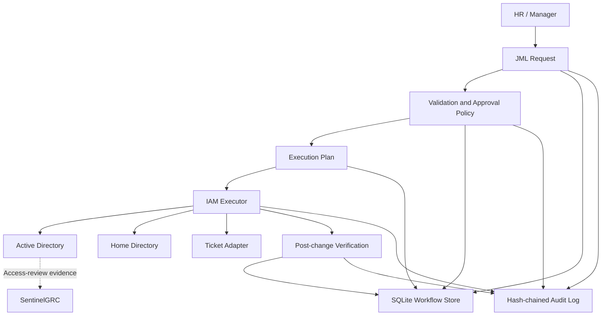
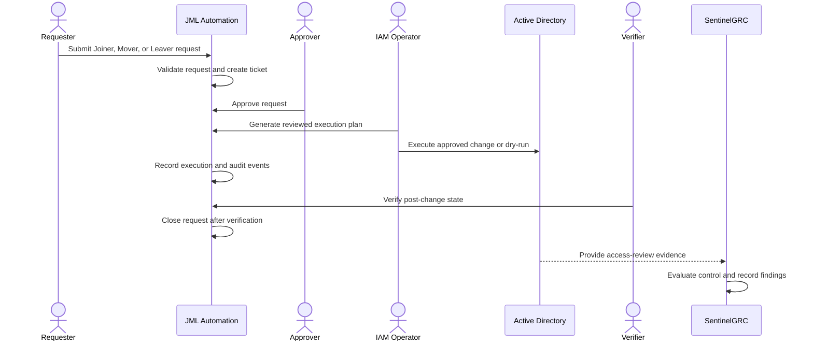

# Sentinel JML Automation

Approval-driven Joiner-Mover-Leaver automation for Active Directory.

## 1. What it is

Sentinel JML Automation is a controlled identity-lifecycle workflow for three employee events:

- **Joiner:** a new employee joins the organization.
- **Mover:** an employee changes department or role.
- **Leaver:** an employee leaves the organization.

The MVP connects request submission, validation, approval, execution planning, execution, verification, ticket tracking, and audit evidence in one workflow. It is designed to make Active Directory changes repeatable, reviewable, and safer than manual administration.

The project extends the bulk Active Directory provisioning work from `home-lab-v2` and is designed to provide future access-review evidence to [SentinelGRC](https://github.com/SuriyaBoon/SentinelGRC).

The MVP addresses slow provisioning, incorrect OU or group placement, stale access after department changes, enabled accounts after termination, orphaned accounts, and changes without reliable audit evidence.

The Leaver workflow disables the account and removes managed group memberships. It does not delete the account or its data, leaving retention decisions to the organization.

## 2. How it works

The workflow is implemented as an approval-controlled state machine:

```text
Request -> Validate -> Approve -> Plan -> Execute -> Verify -> Close
```

Requests and lifecycle state are persisted in SQLite. Execution is allowed only after approval, and the default executor is a dry-run adapter.

The main control rules are:

```text
Requester != Approver
Executor != Verifier
Approval is required before an execution plan is created
Verification is required before a request can be closed
```

Joiner planning creates account, OU, department-group, home-directory, and forced-password-change operations.

Mover planning removes old department groups, moves the account to the new OU, and assigns new department groups.

Leaver planning disables the account and removes managed group memberships without deleting the account or data.

The complete architecture and state machine are documented in [`docs/blueprint.md`](docs/blueprint.md).

This MVP demonstrates a safe identity-lifecycle workflow. It does not claim to be a complete enterprise IAM platform or a live production Active Directory deployment.

### Architecture diagram



### Lifecycle sequence diagram



## 3. Commands used

### Initialize the database

```powershell
python -m jml.cli init --db runtime/jml.db
```

### Joiner workflow

```powershell
python -m jml.cli submit --db runtime/jml.db --request sample_data/joiner.json
python -m jml.cli approve --db runtime/jml.db --request JML-000001 --actor manager-01
python -m jml.cli plan --db runtime/jml.db --request JML-000001 --actor iam-01
python -m jml.cli execute --db runtime/jml.db --request JML-000001 --actor iam-01 --dry-run
python -m jml.cli verify --db runtime/jml.db --request JML-000001 --actor verifier-01 --passed
python -m jml.cli close --db runtime/jml.db --request JML-000001 --actor verifier-01 --reason "All post-change checks passed"
```

Use [`sample_data/mover.json`](sample_data/mover.json) or [`sample_data/leaver.json`](sample_data/leaver.json) to test the other lifecycle events.

### Export an execution plan for review

```powershell
python -m jml.cli plan --db runtime/jml.db --request JML-000001 --actor iam-01 --output runtime/plan.json
```

### View request state and audit history

```powershell
python -m jml.cli show --db runtime/jml.db --request JML-000001
```

### Run the PowerShell adapter safely

```powershell
.\powershell\Invoke-JMLPlan.ps1 -PlanPath runtime/plan.json -DryRun
```

The local ticket adapter writes reviewable records to `runtime/tickets.json`.

### Run all tests

```powershell
python -m unittest discover -v
```

## 4. Evidence that it works

The current repository validation demonstrates:

```text
6 tests - OK
Python compile check - OK
CLI end-to-end smoke test - OK
```

The tests cover:

- complete Joiner lifecycle;
- Mover group transition planning;
- Leaver no-delete policy;
- requester, approver, executor, and verifier separation;
- replay rejection and idempotency controls;
- audit event creation;
- ticket creation and lifecycle updates.

For a successful Joiner workflow, the audit timeline contains:

```text
request_submitted
ticket_created
request_approved
plan_created
execution_started
execution_completed
verification_completed
request_closed
```

The evidence proves the MVP workflow and its safety policies work in the isolated test environment. It is not live Active Directory evidence because the default executor is dry-run and the repository uses a local SQLite database. Live validation should be performed in an isolated AD lab using a delegated service account before any production deployment.

## 5. What problem it solves

The project replaces uncontrolled manual identity changes with an approved and repeatable operating process:

```text
Manual account changes
    -> Approved identity lifecycle workflow
    -> Verifiable execution and audit evidence
```

When connected to real Active Directory, the expected operational benefits are:

- faster account provisioning;
- fewer provisioning and group-assignment errors;
- fewer stale or orphaned accounts;
- faster and more consistent offboarding;
- clearer ownership and approval evidence;
- easier investigation of who changed what and when.

The relationship with SentinelGRC is:

```text
JML Automation
    -> performs approved identity changes
    -> produces access-review evidence
    -> SentinelGRC evaluates the relevant control
    -> governance findings are created for orphaned or excessive access
```

JML Automation is the operational identity-change layer. SentinelGRC is the governance and assurance layer.

## Safety model

- No execution before approval.
- Dry-run is the default for the CLI executor.
- A requester cannot approve their own request.
- An executor cannot verify the same request.
- Leaver operations disable access; they do not delete accounts.
- Secrets are not stored in this repository.
- Lifecycle actions are written to an append-only, tamper-evident hash chain.
- Ticket creation and closure are recorded by the local reviewable ticket adapter.

## Planned integration

```text
JML Automation -> Active Directory access-review evidence -> SentinelGRC governance finding
```

## Production boundary

Before production use, replace SQLite with PostgreSQL, add OIDC/SSO and MFA, use a managed secret store, run PowerShell through a delegated service identity, add TLS/WAF and durable job processing, and test backup, restore, monitoring, and incident recovery.

HRIS, Microsoft 365, real ticketing, SSO/MFA, and destructive account deletion are intentionally outside this MVP.
