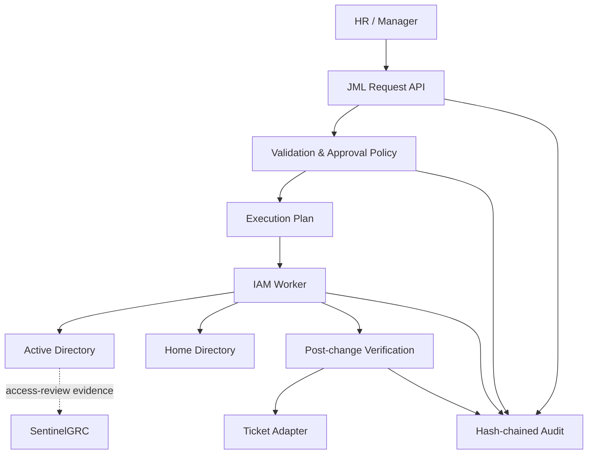

# JML Automation MVP Blueprint

## Workflow

```text
Request → Validate → Approval → Plan → Execute → Verify → Close
```

## Enterprise boundary



## Roles

`requester`, `hr`, `manager`, `iam_operator`, `verifier`, `admin`

The requester cannot approve. The executor cannot verify. Leaver workflows disable access and remove managed group membership; they do not delete accounts or data.

## MVP acceptance criteria

- Joiner creates a deterministic plan for account, OU, groups, home directory, and forced password change.
- Mover removes old department groups and adds the new department groups.
- Leaver disables the account and removes managed access without a delete operation.
- No plan executes before approval.
- Replaying a request is rejected.
- Every lifecycle event is persisted and hash-linked.
- Dry-run is safe and is the default operational mode.

